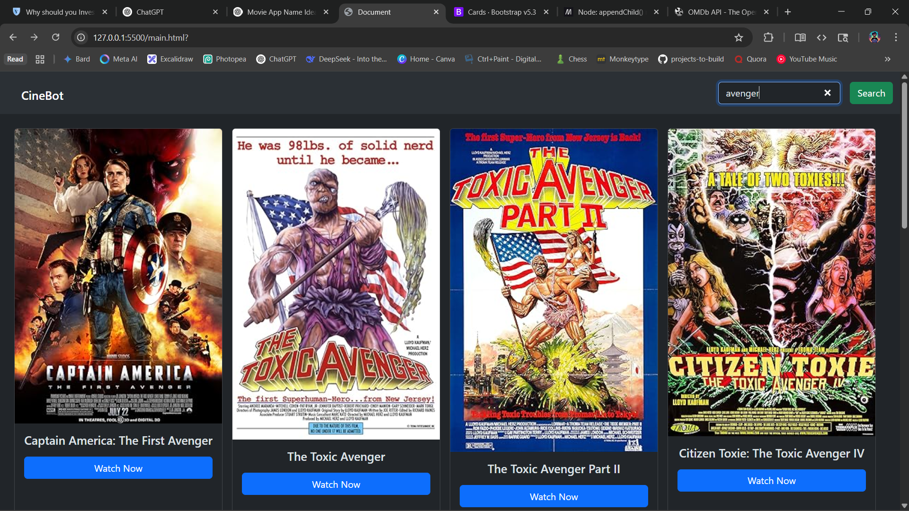

# 🎬 CineBot – Movie Search App

CineBot is a lightweight movie search web app built using HTML, JavaScript, and Bootstrap. It allows users to search movies using the OMDb API and displays results as dynamic cards.

---

## 🔧 Features

- 🔍 Search movies by name
- 🎞️ Display results as Bootstrap cards
- 🧠 Caches responses in localStorage
- 💡 Fetches data from [OMDb API](https://www.omdbapi.com/)
- 🎨 Responsive and dark-themed layout with Bootstrap 5

---

## 📦 Tech Stack

- HTML5
- CSS3 (Bootstrap 5)
- JavaScript (ES Modules)
- OMDb API (Free public API)

---

## 🚀 Getting Started

### 1. Clone this repo
```bash
git clone https://github.com/your-username/cinebot.git
cd cinebot
